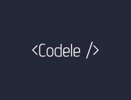

  

<h1 align="center">
  <b>Codele</b>
</h1>

  A daily programming language guessing game
   
  <a href="https://codele-voffiee.vercel.app/"><strong>https://codele-voffiee.vercel.app/</strong></a>

  <strong>Built with</strong>
   
  
  
  
  

## About

**Codele** is a fun and interactive daily guessing game where players try to identify the programming language of the day. Each day brings a new challenge, with clues designed to test and improve your knowledge of various programming languages.

## Inspirations
Codele draws inspiration from similar games like:

* [Wordle](https://www.nytimes.com/games/wordle/index.html)
* [LoLdle](https://loldle.net/)
* [Gamedle](https://www.gamedle.wtf/)
