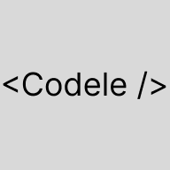
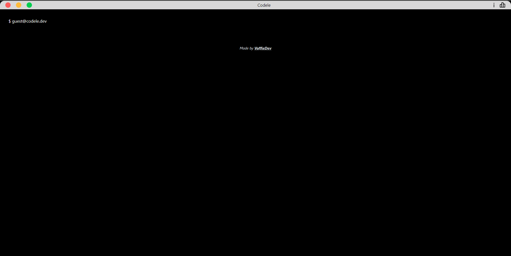
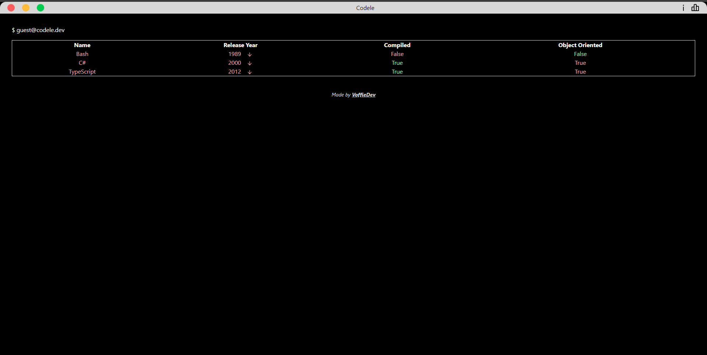

  

    
  

  <h1 align="center"><b>Codele</b></h1>
  

    A daily guessing game
     
    <a href="https://codele-voffiee.vercel.app/"><strong>https://codele-voffiee.vercel.app/ »</strong></a>
     
     
    <strong>Built with</strong>
     
    
    
    
    
     
  

Codele is a website where your goal is to guess the programming language of the day. It is inspired by [Wordle](https://www.nytimes.com/games/wordle/index.html) as well as [LoLdle](https://loldle.net/) & [Gamedle](https://www.gamedle.wtf/)

  
  

